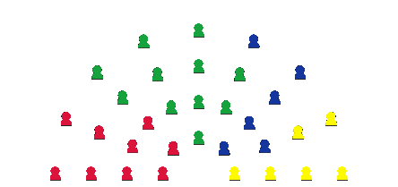

    
    <h1>To Be Decided</h1>

Lead Evil Inc. to world domination in the global Teewurst market and destroy all communist kangaroos along the way!
Manipulate parliament and the stock market to satisfy your desires! Use your botnet to influence the media! Embrace cars, screw consumers, and establish your own dictatorship!

## Playing

You can play this game online [here](https://geldwaschbar.github.io/to-be-decided/).

To play locally, run the project with `cargo run` or, if you are on NixOS, use `nix run github:Geldwaschbar/to-be-decided`.

## Controls

> [!WARNING]
> This game does not support mobile devices and should be played with a resolution of 1920x1080.

'To Be Decided' is controlled using either a mouse or touchpad. You can interact with the UI by clicking buttons, dragging sliders and scrolling the law and news containers.

## Features
> [!NOTE]
> This game is still a work in progress and may not be considered playable by some.

- **The Parliament** decides on a law every day. It will decide on the law with the highest visibility. You can increase or decrease the visibility of a law by lobbying for or against it. Lobbying costs $100. Whenever a law is passed, it affects the parliament and stock market directly.
- **The stock market** represents your success in managing Evil Inc. Every day, your money will increase by 10% of the current stock market price. Money is the primary resource for influencing parliament.
- **The botnet** allows you to directly influence the media and public opinion. By distributing malware, your botnet grows. Posting memes makes your preferred party more popular in the eyes of the public. You can farm crypto to earn more money. When you use bribery, parliament will vote in favour of your laws more often.

## Credits

- Game by Leo, Janik and Karl
- Font by VileR (https://int10h.org/)
- Sound by 101soundboards (https://www.101soundboards.com/sounds/27014532-old-pc-turn-on-boot-turn-off-turn-on-old-personal-turn-off-boot-at-magedu)

## Disclaimer

All characters and events in this game — even those based on real people — are entirely fictional.
